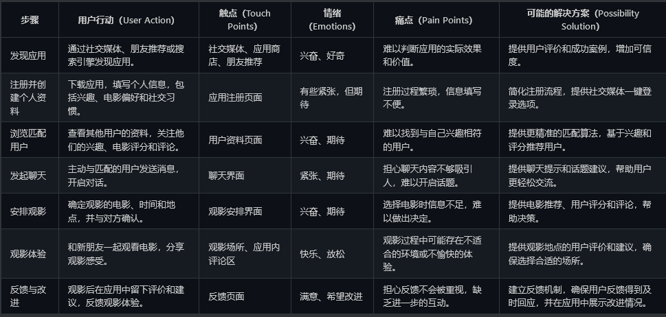

Elevator Pitch:  
prompt: 我需要设计一个叫“see movie together”的app，我希望实现是一个核心功能就是能够感知一定范围内的其他人，让用户可以选择联系范围内兴趣相似的人一起看电影，也会推荐给用户一些兴趣相似的人。我现在要你帮我写Elevator Pitch，你还可以和我确认一些细节  
chatbot:好的，我可以帮助您撰写一个 Elevator Pitch。为了确保内容符合您的需求，我想确认以下几个细节：  
    目标受众：您希望这个 Pitch 针对哪些人群？是投资者、用户，还是其他类型的受众？  
    关键功能：您希望强调哪些核心功能？例如，社交功能、推荐算法、用户界面等。  
    应用场景：您希望 Pitch 中包含具体的使用场景或例子吗？比如用户如何使用这个应用？  
    情感基调：您希望 Pitch 保持轻松、友好，还是更正式和专业？  
    时间限制：您希望这个 Elevator Pitch 多长时间？通常是30秒到1分钟。  
    请您确认这些细节，我将根据您的需求为您准备一个合适的 Elevator Pitch。  
prompt: 1.16-45岁，社交能力较差，空闲时间比较多，希望志同道合的朋友  
        2.社交功能、兴趣相似的人的推荐算法、用户界面，感兴趣的电影推荐算法。  
        3.希望  
        4.情感基调：保持轻松、友好  
        5.1分钟。  
result: 想象一下，如果你能在舒适的家中，轻松找到志同道合的朋友，一起享受电影的乐趣！我们推出的“See Movie Together”应用正是为此而生。无论你是16岁还是45岁，如果你在社交上有些羞涩，或者只是希望结识一些有共同兴趣的朋友，这个应用将是你的完美选择。  
        我们的核心功能是智能推荐算法，它可以感知你周围一定范围内的用户，找到那些兴趣相似的人。想看一部新片？我们会根据你的口味推荐适合的电影，并帮助你与同样感兴趣的朋友联系。用户友好的界面让你轻松浏览电影、聊天和安排观影时间，享受无压力的社交体验。  
        无论你是想找个伴一起看最新大片，还是希望与志同道合的人分享旧片经典，“See Movie Together”都能帮助你实现。让我们一起，开启一段精彩的电影之旅吧！  
  
User Persona:  
prompt: 你是一个资深产品经理，我现在需要做一个User Persona，创建一个用户角色，请考虑以下要素：  
        背景特征：描述用户的教育水平、职业类型和收入范围。  
        兴趣与爱好：列出用户可能的兴趣和爱好，特别是除了观看电影之外的活动。  
        观影习惯：说明用户的观影习惯，特别是他们是否倾向于在电影院观看电影。  
        设备使用：评估用户在技术使用方面的熟练程度，特别是他们使用手机应用的习惯。  
        挑战与需求：识别用户在寻找电影和社交互动时可能面临的挑战，以及他们希望通过“情感影院”平台解决的具体需求。  
        请确保用户画像真实且具体希望通过“See Movie Together”结识志同道合朋友的目标、面临的社交挑战，以及对应用的期望和需求。  
result:
    姓名：李明  
    年龄：29岁  
    背景特征：  
        教育水平：硕士，主修计算机科学  
        职业类型：软件工程师  
        收入范围：年收入约15万-20万人民币
    兴趣与爱好：  
        除了观看电影，李明还喜欢阅读科技和小说类书籍，参与编程社区，和朋友一起打桌游。  
        他热衷于户外活动，如徒步旅行和骑行，喜欢探索新地方。  
        他还对音乐有兴趣，常去现场音乐会和音乐节。
    观影习惯：  
        李明每月会去电影院观看2-3部新片，特别偏爱科幻和动作片。  
        他也会在家观看电影，尤其是平日晚上，通过流媒体平台观看经典影片和热门剧集。  
        他喜欢与朋友一起观影，享受讨论电影情节和技术的乐趣。
    设备使用：  
        李明对技术使用非常熟练，日常使用智能手机、平板电脑和笔记本电脑。  
        他习惯使用各种手机应用，包括社交媒体、流媒体平台和购物应用，常通过应用获取电影推荐和评论。
    挑战与需求：  
        挑战：在寻找电影时，李明常常感到信息过载，难以选择适合自己口味的影片。  
        在社交方面，他虽然有一定朋友，但由于工作繁忙，难以主动结识新朋友，尤其是对电影感兴趣的朋友。  
        需求：希望通过“See Movie Together”平台找到志同道合的朋友，能够一起讨论电影和分享观影体验。  
        他希望应用提供个性化的电影推荐、便捷的用户匹配功能，以及能够轻松发起聊天和安排观影活动的界面，增强社交互动的机会。  
  
User Journey:  
prompt:你是一个资深产品经理，我现在需要做一个User Journey，创建“See Movie Together”用户旅程时，请描述用户从发现应用到观影的全过程，包括以下步骤：  
    发现应用（社交媒体、朋友推荐等）  
    注册并创建个人资料（填写兴趣、电影偏好）  
    浏览匹配用户（查看用户资料、兴趣）    
    发起聊天（与志同道合用户互动）  
    安排观影（选择电影、时间、地点）  
    观影体验（分享感受、评分电影）  
    反馈与改进（用户对应用的评价和建议）  
    关注用户的情感变化和需求  
以表格的形式返回结果给我，该表格包含了用户行动（User Action）、触点（Touch Points）、情绪（Emotions）、痛点（Pain Points）以及可能的解决方案（Possibility Solution）五个方面。  
result:  
  
Movie Poster:  
Design a minimalist movie poster for 'Vengeful Knight'. Focus on a silhouette of a knight in armor, with a raised sword against a vibrant sunset background. Incorporate abstract shapes to symbolize conflict and revenge. Use sleek, modern typography for the title at the top and add the tagline: 'A quest for justice.' The overall color palette should include deep reds, oranges, and blacks to evoke a sense of drama.
